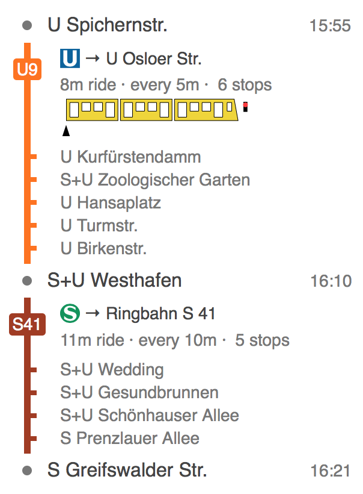

# vbb-journey-ui

**[virtual-dom](https://github.com/Matt-Esch/virtual-dom) UI components for displaying a journey** like in Google Maps.

[](https://www.npmjs.com/package/vbb-journey-ui)
[](https://travis-ci.org/derhuerst/vbb-journey-ui)

[](https://gitter.im/derhuerst)
[](https://patreon.com/derhuerst)




## Installing

```shell
npm install vbb-journey-ui
```


## Usage

`renderJourney` returns a [virtual-dom](https://github.com/Matt-Esch/virtual-dom) tree, which you can put into the [DOM](https://developer.mozilla.org/en-US/docs/Web/API/Document_Object_Model/Introduction) or [convert to an HTML string](https://www.npmjs.com/package/virtual-dom-stringify).

```js
const {DateTime} = require('luxon')
const ms = require('ms')
const createVbbClient = require('vbb-hafas')
const createRenderJourney = require('vbb-journey-ui')
const toString = require('virtual-dom-stringify')

const formatTime = (when) => {
	return DateTime.fromJSDate(when, {
		zone: 'Europe/Berlin',
		locale: 'de-DE'
	}).toLocaleString(DateTime.TIME_SIMPLE)
}

const formatDelay = (delay) => {
	if (delay === 0) return null // todo: show +0
	const color = Math.abs(delay) >= 30 ? '#c0392b' : '#27ae60'
	const text = delay < 0
		? '-' + ms(-delay * 1000)
		: '+' + ms(delay * 1000)
	return h('span', {style: {color}}, [text])
}

const renderJourney = createRenderJourney(formatTime, formatDelay, {})

const vbb = createVbbClient('my-awesome-program')
vbb.journeys('900000003201', '900000024101', {results: 1, stopovers: true})
.then((journeys) => {
	const tree = renderJourney(journeys[0])
	console.log(toString(tree))
})
.catch(console.error)
```

## API

```
createRenderJourney(formatTime, formatDelay, [actions]) => renderJourney
renderJourney(journey, [detailsFor], [actions]) => virtualDomTree
```

`formatTime` must be a with the signature `(when: Date) => string`.

`formatDelay` must be a with the signature `(delay: number) => string`.

`actions` may be an object with the following methods:

- `actions.hideLegDetails(i)`
- `actions.showLegDetails(i)`
- `actions.selectStop(stopId, [stationId])`

`journey` must be a [*Friendly Public Transport Format* `1.0.1` `journey` object](https://github.com/public-transport/friendly-public-transport-format/blob/1.0.1/spec/readme.md#journey).

`detailsFor` may be an array of `journey.legs` indices that additional info like passed stations shall be shown for.

`renderJourney` returns a [virtual-dom](https://github.com/Matt-Esch/virtual-dom) tree.


## Contributing

If you have a question or have difficulties using `vbb-journey-ui`, please double-check your code and setup first. If you think you have found a bug or want to propose a feature, refer to [the issues page](https://github.com/derhuerst/vbb-journey-ui/issues).
